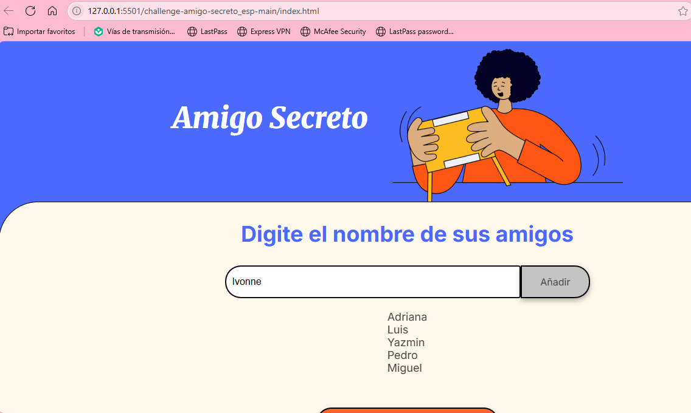
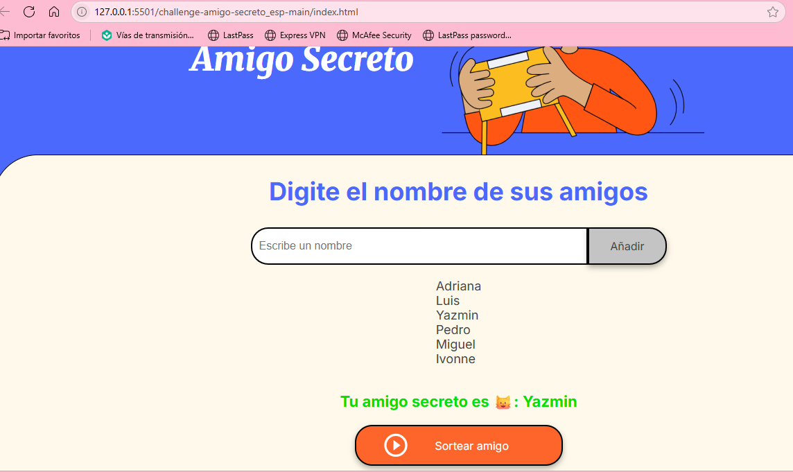

# 🎁 Amigo Secreto

Aplicación web en **HTML, CSS y JavaScript** que permite ingresar nombres de amigos y realizar un **sorteo aleatorio** para elegir al “amigo secreto”.

## 👩‍💻 Autoría
Proyecto realizado por **[Rocio Ivoone Perez Gonzalez]** como práctica del reto *Amigo Secreto Alura LATAM*.

---

## ✨ Funcionalidades
- ➕ Agregar nombres a una lista.
- ✅ Validación: si el campo está vacío muestra “Por favor, inserte un nombre.”
- 📋 Visualización de la lista en pantalla.
- 🎲 Sorteo aleatorio y muestra del resultado.

---

## 🚀 Cómo usar
1. Abre `index.html` en tu navegador.
2. Escribe un nombre y pulsa **Añadir**.
3. Pulsa **Sortear amigo** para elegir uno al azar.

---

## 🖼️ Capturas

**Pantalla principal**

### Amigos agregados

### Sorteo del amigo secreto

---

## 📁 Estructura del proyecto

.
├── index.html          # Archivo principal
├── style.css           # Estilos de la aplicación
├── app.js              # Lógica en JavaScript
├── README.md           # Documentación del proyecto
└── assets/             # Carpeta con imágenes y recursos
    ├── amigo-secreto.png
    ├── pagina-principal.png
    ├── amigos-agregados.png
    └── sorteo-amigo-secreto.png

## 🚧 Mejoras futuras
- Evitar que se repitan nombres en la lista.
- Guardar la lista en el navegador usando LocalStorage.
- Añadir opción para eliminar un nombre.
- Agregar animaciones al sorteo.

